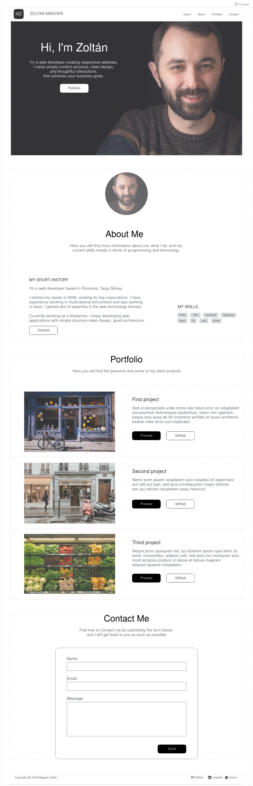

# Portfolio page

This project is about giving an brief insight into my skill, expertiese and example projects.

## Wireframe of the page



## Running the app

It is a HTML, CSS and JavaScript web page. It does not require any type of build process. It just has to be exposed in a web server. In the initial phase of the development locally I used [live-server](https://www.npmjs.com/package/live-server). The command to run the web page locally was:

```shell
live-server -q --no-browser --port=10000
```

The command should be executed in a shell.

-   The `-q` stands for quiet mode. No log will be written to the standard output.
-   The `--no-browser` will stop the live-server to launch the default browser and open the page in a new tab.
-   The `--port=10000` will expose the page on the port 10000. The URL will be [http://localhost:10000](http://localhost:10000)

My goal is to dockerize the page to be easely deployable and to automate the deployment process. In order to do that the next phase is to set up a docker environment locally. To read more about how to setup a docker desktop locally, please follow this link [https://www.docker.com/products/docker-desktop](https://www.docker.com/products/docker-desktop).

To deploy the web page into a docker and to expose it on the port 10000 like it was with the live-server, the following shell command has to be executed.

```shell
docker run --name docker-container-name -v ../path/to/webpage:/usr/share/nginx/html:ro -d -p 10000:80 nginx
```

Inside the docker I used the nginx web server. For further inforrmations please read [https://hub.docker.com/\_/nginx](https://hub.docker.com/_/nginx/).

-   The `--name` defines a name for the docker container that will be lauched with this command, so that is more easaly identifiable for humans.
-   The `-d` starts the docker in detached mode, so the terminal won't get locked.
-   The `-v` option creates a volume. It will mount a folder of the host (/path/to/webpage) into a folder (/usr/share/nginx/htlm) of the docker container.
-   The `-p` defines a port mapping. The fist port (10000) defines the port on which the host machine can reach the web page. The second port defines the port of the docker on which the docker itself exposes the web page.

## Releases

### v2.0

-   Fixing review comments.
-   Creating a readme

### v1.0

-   Initial layout and styling of the portfolio page.
